# Automate OpenShift Deployments using Tekton CI and Argo CD

In this code pattern, we will [create something] using [technologies] and [components]. [Explain briefly how things work]. [Give acknowledgements to others if necessary]

When you have completed this code pattern, you will understand how to:

* [goal 1]
* [goal 2]
* [goal 3]
* [goal 4]

<!--add an image in this path-->
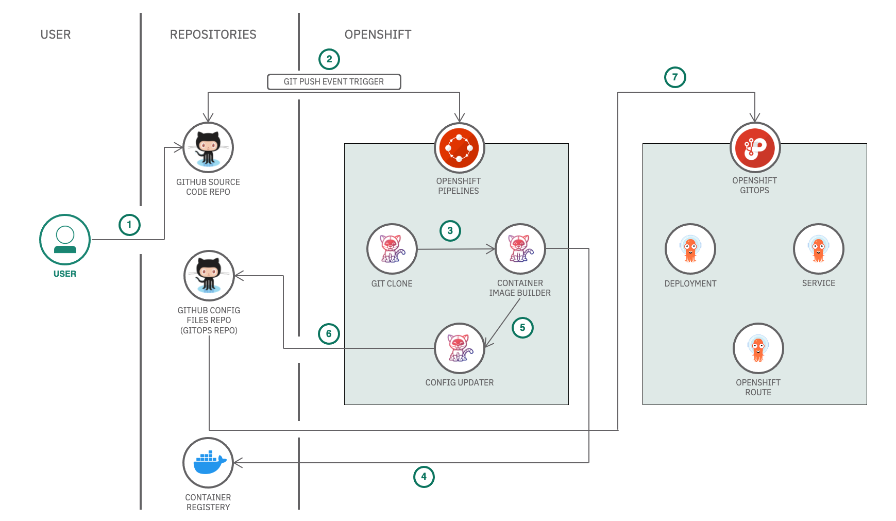

<!--Optionally, add flow steps based on the architecture diagram-->
## Flow

1. User checks in the code to the source control repository
2. GitHub webhook triggers an OpenShift Pipeline on the push event
3. First Tekton CI task runs to clone the code from the GitHub repository
4. Second Tekton CI task runs to build the container image from the source code. The image is then pushed to the container registry
5. Third Tekton CI task runs to update the deployment configuration with the new image and store the configuration files in the GitOps repository
6. The OpenShift GitOps picks up the configuration files from the GitOps repository and deploys to the OpenShift cluster

# Watch the Video

Coming Soon!
<!-- [](https://www.youtube.com/watch?v=Jxi7U7VOMYg) -->

# Steps

1. [Setup Repositories](#1-setup-repositories)
    * 1.1. [Setup source code repository](#11-setup-source-code-repository)
    * 1.2. [Setup GitOps repository](#12-setup-gitops-repository)
    * 1.3. [Setup container registry](#13-setup-container-registry)
2. [Setup OpenShift Pipeline Operator](#2-setup-open-shift-pipeline-operator)
    * 2.1. [Deploy OpenShift Pipeline on the cluster](#21-deploy-open-shift-pipeline-on-the-cluster)
    * 2.2. [Create Tekton Tasks, Pipeline and Secrets](#22-create-tekton-tasks-pipeline-and-secrets)
    * 2.3. [View the Tekton Pipeline](#23-view-the-tekton-pipeline)
3. [Setup OpenShift GitOps Operator](#3-setup-open-shift-gitops-operator)
    * 3.1. [Deploy OpenShift GitOps on the cluster](#31-deploy-open-shift-gitops-on-the-cluster)
    * 3.2. [Create ArgoCD Application](#32-create-argo-cd-application)
    * 3.3. [View the ArgoCD Application](#33-view-the-argo-cd-application)
4. [Setup Trigger and Event Listener](#4-setup-trigger-and-event-listeners)
    * 4.1. [Create a Tekton Trigger for the Tekton Pipeline](#41-create-a-tekton-trigger-for-the-tekton-pipeline)
    * 4.2. [Add webhook to the source code repository](#42-add-webhook-to-the-source-code-repository)
5. [Automated deployment of the application in action](#5-automated-deployment-of-the-application-in-action)

## 1. Setup Repositories

### 1.1. Setup source code repository

We have created a Template Repository with a sample application. You can use the sample application to complete this code pattern.

* Create a repository with [this template on GitHub](https://github.com/IBM/sample-temperature-converter-app/generate). It can be a public or private Repository.
* Once the repository is created, create a [Personal Access Token](https://github.com/settings/tokens/new) with scope=`public_repo` if its a public repository or scope=`repo` if its a private repository.
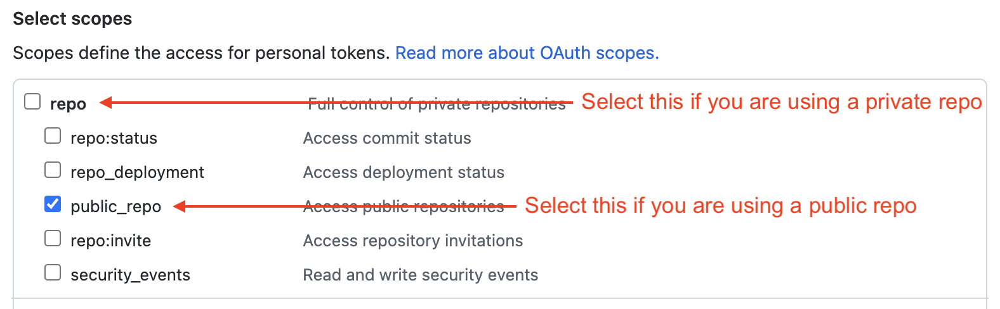
    >Note: Make sure to copy your personal access token when its generated. You won’t be able to see it later!

#### About the application

The app that you see in the repository is a simple temperature converter application built with NodeJS and Express framework.

**Note:** Copy the GitHub source code repository url as it will be used in the subsequent steps.

**Note:** Copy the GitHub Personal Access Token as it will be used in the subsequent steps.

### 1.2. Setup GitOps repository

We have created a Template Repository with Helm chart for the sample application. You can use the Helm chart for the sample application to complete this code pattern.

* Create a GitOps repository with [this template on GitHub](https://github.com/IBM/sample-temperature-converter-gitops/generate). It can be a public or private Repository.
    > Note: The same personal access token that you created above will be used to access the GitOps repository.

**Note:** Copy the GitHub GitOps repository url as it will be used in the subsequent steps.

### 1.3. Setup container registry

You will need a container registry to store the container images generated by the tekton pipeline. You can use any container registry of your choice. In this code pattern, we'll show you how to create a DockerHub container registry.

* Create a [Docker ID](https://hub.docker.com/) or Login with your existing Docker ID on [Docker Hub](https://hub.docker.com/).
* Goto the [Account Settings > Security](https://hub.docker.com/settings/security) section in your Docker Hub.
* Click on **New Access Token**.
  * Enter **Access Token Description** as `tekton-pipeline`
  * Select **Access permissions** as `Read, Write, Delete`
  * Click on **Generate**.
* Copy the Access Token.
    > Note: This access token will only be displayed once. It will not be stored and cannot be retrieved. Please be sure to save it now.

**Note:** Copy the Docker Personal Access Token as it will be used in the subsequent steps.

## 2. Setup OpenShift Pipeline Operator

Red Hat OpenShift Pipelines is a cloud-native continuous integration and delivery (CI/CD) solution for building pipelines using Tekton.

Tekton is a powerful and flexible Kubernetes-native open-source CI/CD framework, which enables automating deployments across multiple platforms (Kubernetes, serverless, VMs, etc) by abstracting away the underlying details.

> Learn more about Tekton here: [tekton.dev](https://tekton.dev)

### 2.1. Deploy OpenShift Pipeline on the cluster

Open your OpenShift web console. Follow the instructions to deploy the OpenShift Pipeline Operator on your OpenShift cluster.

* Goto **Operators > OperatorHub** and search for **OpenShift Pipeline**. Select the **Red Hat OpenShift Pipelines** operator.
    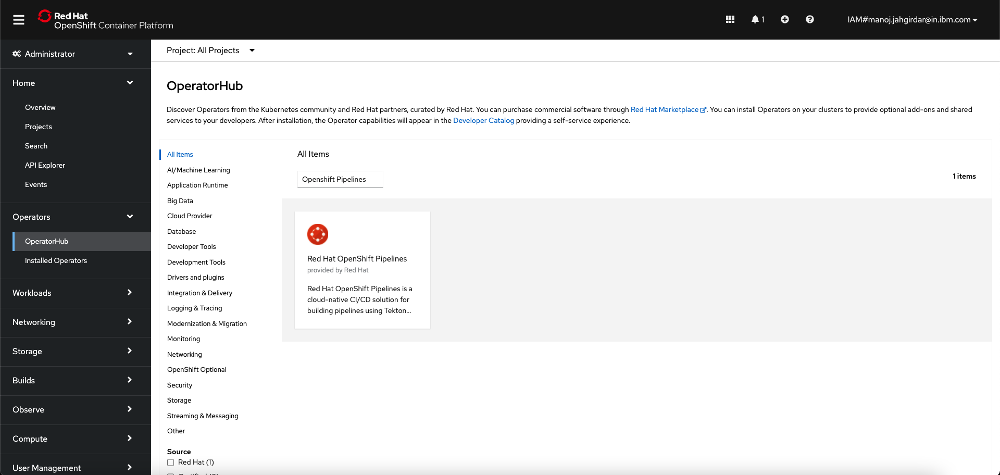
* Click on **Install** in the panel.
    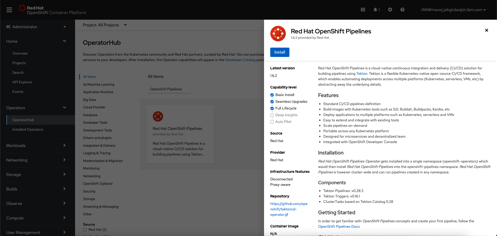
* Select the following options:
  * Update channel: **stable**
  * Installation modes: **All namespace on the cluster (default)**
  * Installed Namespace: **openshift-operators**
  * Update approval: **Automatic**

  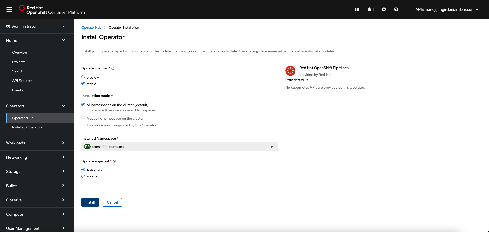
  * Click on **Install**.
  * Wait for the installation to complete. Once complete you will see the following message.

  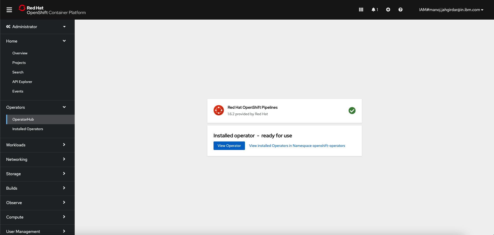

At this point you have successfully deployed OpenShift Pipelines on your OpenShift cluster. A new **Pipelines** tab will appear on the left panel of the OpenShift web console under **Administrator** view as shown.

>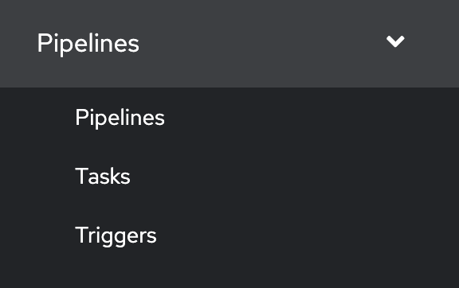

### 2.2. Create Tekton Tasks, Pipeline and Secrets

You will learn how to deploy tekton tasks, pipelines and secrets using the `tkn` commandline tool. You will refer to the deployment config files from this repository. Follow the instructions to create the Tekton Tasks, Pipeline and Secrets.

* Clone the GitHub Repo. In terminal, run:

    ```bash
    git clone https://github.com/IBM/automate-deployments-on-openshift.git
    ```

* You will be referring to the `automate-deployments-on-openshift/scripts` directory.

* The `automate-deployments-on-openshift/scripts` directory consists of the following:

    ```bash
    scripts
    ├── CD
    │   ├── GitOps
    │   │   ├── ArgoCD
    │   │   │   └── application.yaml
    │   │   └── RBAC
    │   │       └── rbac.yaml
    │   ├── delete-GitOps.sh
    │   └── setup-GitOps.sh
    ├── CI
    │   ├── Tekton
    │   │   ├── Pipeline
    │   │   │   └── pipeline.yaml
    │   │   ├── Secrets
    │   │   │   ├── container-registry-secrets.yaml
    │   │   │   └── github-secrets.yaml
    │   │   └── Tasks
    │   │       ├── app-nodejs-build.yaml
    │   │       ├── app-setup.yaml
    │   │       ├── config-updater.yaml
    │   │       └── container-image-builder.yaml
    │   ├── delete-tekton.sh
    │   └── setup-tekton.sh
    ├── delete-CD.sh
    ├── delete-CI.sh
    ├── setup-CD.sh
    └── setup-CI.sh

    9 directories, 17 files
    ```

* The `scripts/CI/Tekton` directory consists of the Tekton deployment config files.

    Files|Kind|Description
    --|--|--
    Tasks/app-setup.yaml|Tekton Task|This task checkes if the GitHub repository is accessible.
    Tasks/app-nodejs-build.yaml|Tekton Task|This task builds the NodeJS application and runs the test cases.
    Tasks/container-image-builder.yaml|Tekton Task|This task builds the container image and pushes it to the container registry.
    Tasks/config-updater.yaml|Tekton Task| This task updates the configuration files in the GitOps Repository.
    Secrets/container-registry-secrets.yaml|Tekton Secret| This is a secret containing DockerHub credentials.
    Secrets/github-secrets.yaml|Tekton Secret| This is a secret containing GitHub credentials.
    Pipeline/pipeline.yaml|Tekton Pipeline| This is the Tekton pipeline definition.

* The `scripts/CD/GitOps` directory consists of the Argo CD deployment config files.
    Files|Kind|Description
    --|--|--
    ArgoCD/application.yaml|Argo CD Application| This is the Argo CD application definition.
    RBAC/rbac.yaml|Argo CD RBAC| This is the Argo CD RBAC definition.

* The `scripts/setup-CI.sh` and `scripts/delete-CI.sh` scripts are used to setup and delete the CI environment.

* The `scripts/setup-GitOps.sh` and `scripts/delete-GitOps.sh` scripts are used to setup and delete the GitOps Repository.

* Before creating the Tekton Tasks, Pipeline and Secrets, you will need to export some environment variables that will be used by the shell script. Following are the environment variables that you need to export:

    Environment Variables|Description
    --|--
    GIT_URL|The Git URL of the GitHub repository created in [Step 1.1](#11-setup-source-code-repository).
    GIT_BRANCH|The Git branch of the GitHub repository usually it is **Main**.
    GITOPS_URL|The Git URL of the GitOps repository created in [Step 1.2](#12-setup-gitops-repository).
    CONTAINER_IMAGE_NAME|The name of the container image that will be used to build container images and store them in the container registry. **Note: the container image name should be prefixed with your DockerHub username. Example: manojjahgirdar/automate-openshift-deployment**
    CONTAINER_IMAGE_TAG|The tag of the container image. **Example: 1.0**

* Export these variables, In terminal, run:

    ```bash
    export GIT_URL=your-git-url
    export GIT_BRANCH=your-git-branch
    export GITOPS_URL=your-gitops-url
    export CONTAINER_IMAGE_NAME=your-container-image-name
    export CONTAINER_IMAGE_TAG=your-container-image-tag
    ```

>Note: You have to replace the values of the environment variables with the values that you obtained from the above steps.

* Navigate to the `scripts/` directory and run the `setup-CI.sh` script. In terminal, run:

    ```bash
    cd scripts/
    chmod +x setup-CI.sh
    ./setup-CI.sh
    ```

* You will be prompted for **GitHub Username, GitHub Personal Access Token** and **DockerHub Username, DockerHub Personal Access Token**. Enter the GitHub credentials obtained in [Step 1.1](#11-setup-source-code-repository) and DockerHub credentials obtained in [Step 1.3](#13-setup-container-registry).

* You should see output similar to the following:

    ```bash
    -------------Setting up Tekton CI----------------

    Setting up Tekton Tasks...
    task.tekton.dev/app-setup created
    task.tekton.dev/app-nodejs-build created
    task.tekton.dev/container-image-builder created
    task.tekton.dev/config-updater created
    Tekton Tasks setup complete.

    Setting up Tekton Pipeline...
    pipeline.tekton.dev/gitops-build-pipeline created
    Tekton Pipeline setup complete.

    Setting up Tekton Secrets...
    Enter your Git username: # Type your GitHub username and press [ENTER]
    manojjahgirdar
    Enter your Git personal access token: # Type your GitHub personal access token and press [ENTER]
    ghp_xxxxxxxxxxxxxxxxxxxxxxxxxxxxx
    secret/git-credentials created
    secret/git-credentials patched
    Git credentials configured. You can view them by running:
    oc get secret git-credentials -o yaml

    Enter your DockerHub username: # Type your DockerHub username and press [ENTER]
    manojjahgirdar
    Enter your DockerHub personal access token: # Type your DockerHub personal access token and press [ENTER]
    48b1dedb-xxxx-xxxx-xxxx-xxxxxxxxxxxx
    secret/docker-credentials created
    secret/docker-credentials patched
    Docker credentials configured. You can view them by running:
    oc get secret docker-credentials -o yaml

    Tekton Secrets setup complete.

    Patching Pipeline ServiceAccount...
    serviceaccount/pipeline patched
    serviceaccount/pipeline patched
    serviceaccount/pipeline patched
    Pipeline ServiceAccount setup complete.

    Tekton CI pipeline setup complete. Do you want to trigger the pipeline now? (y/n)
    ```

At this point, you have successfully setup the Tekton Tasks, Pipeline and Secrets in your OpenShift cluster. You can now trigger the pipeline by typing **y** in the terminal. The tekton pipeline will be triggered.

```bash
...

Tekton CI pipeline setup complete. Do you want to trigger the pipeline now? (y/n)
y
PipelineRun started: gitops-build-pipeline-run-wv9wb

In order to track the PipelineRun progress run:
tkn pipelinerun logs gitops-build-pipeline-run-wv9wb -f -n <namespace>

-----------Tekton CI setup completed-------------
```

### 2.3. View the Tekton Pipeline

You can view the Tekton PipelineRun progress on commandline with the `tkn` commandline tool or you can view the PipelineRun progress on the OpenShift console.

* To view on the commandline, run:

    ```bash
    tkn pipelinerun logs <pipelinerun-name> -f -n <namespace>
    ```

* To view on the OpenShift console, login to your OpenShift cluster and navigate to the **Pipelines > Pipelines** tab on the left panel.

    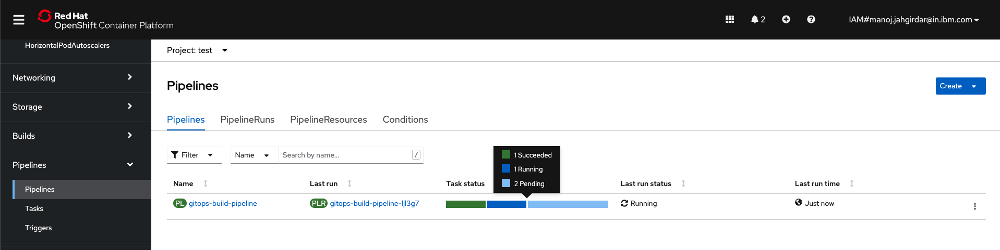

* You will see the pipeline and its status. To view the logs click on the Task status as shown.

    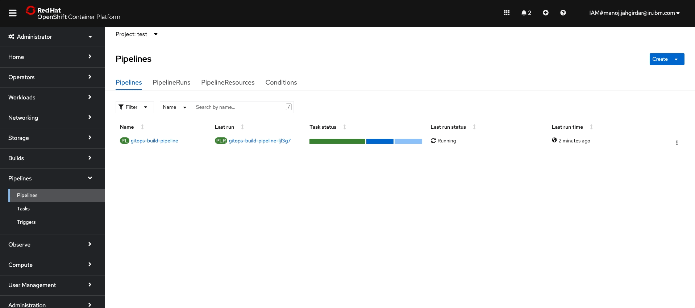

* You can also see the details of the Pipeline and the Tekton Tasks that the pipeline runs by clicking on the **Details** tab as shown.

    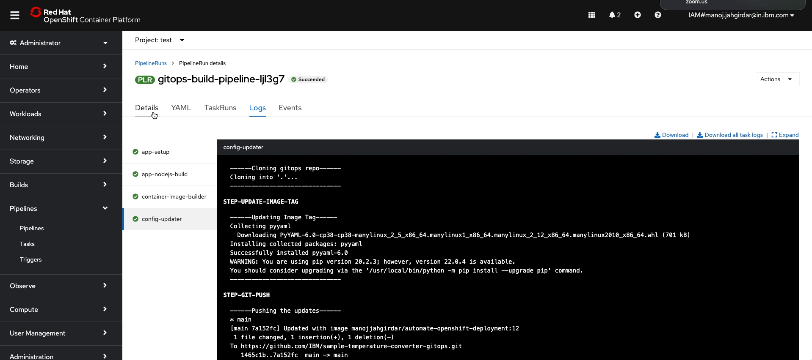

If you have followed the code pattern upto this point correctly, you should be able to see the PipelineRun status as **Succeeded**.

At this point you have successfully setup the OpenShift Pipeline as a continuous integration (CI) mechanism for your application.

## 3. Setup OpenShift GitOps Operator

Red Hat OpenShift GitOps is a declarative continuous delivery platform based on Argo CD. It enables teams to adopt GitOps principles for managing cluster configurations and automating secure and repeatable application delivery across hybrid multi-cluster Kubernetes environments. Following GitOps and infrastructure as code principles, you can store the configuration of clusters and applications in Git repositories and use Git workflows to roll them out to the target clusters.

Argo CD is a declarative, GitOps continuous delivery tool for Kubernetes.

### 3.1. Deploy OpenShift GitOps on the cluster

Open your OpenShift web console. Follow the instructions to deploy the OpenShift GitOps Operator on your OpenShift cluster.

* Goto **Operators > OperatorHub** and search for **OpenShift GitOps**. Select the **Red Hat OpenShift GitOps** operator.
    
* Click on **Install** in the panel.
    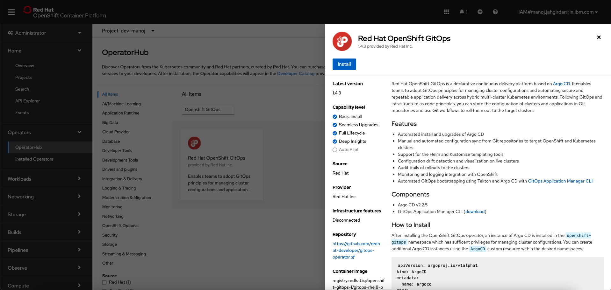
* Select the following options:
  * Update channel: **stable**
  * Installation modes: **All namespace on the cluster (default)**
  * Installed Namespace: **openshift-operators**
  * Update approval: **Automatic**

  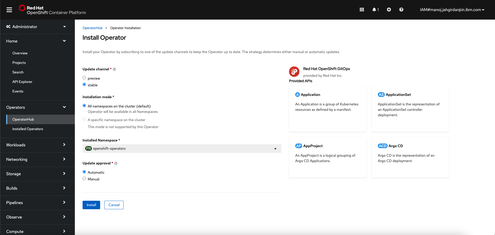
  * Click on **Install**.
  * Wait for the installation to complete. Once complete you will see the following message.

  

At this point you have successfully deployed OpenShift GitOps on your OpenShift cluster. **Cluster Argo CD** will appear on top **menu** as shown.

>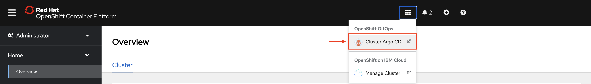

### 3.2. Create ArgoCD Application

### 3.3. View the ArgoCD Application

## License

This code pattern is licensed under the Apache License, Version 2. Separate third-party code objects invoked within this code pattern are licensed by their respective providers pursuant to their own separate licenses. Contributions are subject to the [Developer Certificate of Origin, Version 1.1](https://developercertificate.org/) and the [Apache License, Version 2](https://www.apache.org/licenses/LICENSE-2.0.txt).

[Apache License FAQ](https://www.apache.org/foundation/license-faq.html#WhatDoesItMEAN)
