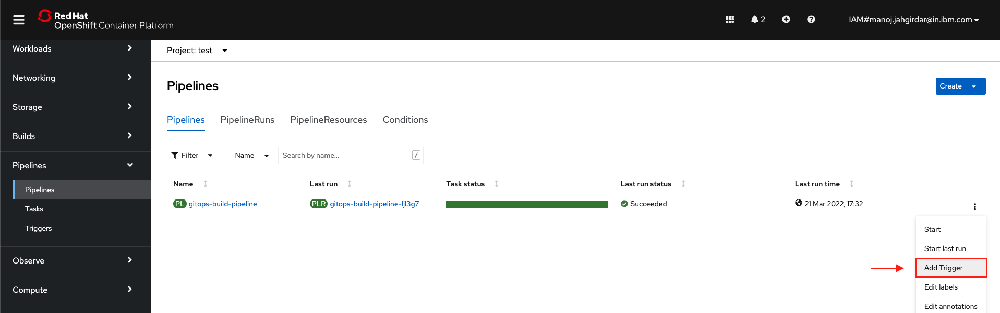

# Automate cloud-native application lifecycle using OpenShift Pipeline and OpenShift GitOps Operators

In this code pattern, you will learn how to create a continuous integration (CI) and a continuous delivery (CD) mechanism for your cloud-native applications using Red Hat OpenShift Pipeline and Red Hat OpenShift GitOps Operators. You will learn how to use Red Hat OpenShift Pipeline to create a pipeline that will build and test your application, build container image for your application and push it to container registry and update the configuration files in the GitOps repository. You will also learn how these configuration files are taken from the GitOps repository and resources are created accordingly on the OpenShift cluster using Red Hat OpenShift GitOps.

>Red Hat OpenShift Pipelines is a cloud-native continuous integration and delivery (CI/CD) solution for building pipelines using Tekton.

>Red Hat OpenShift GitOps is a declarative continuous delivery platform based on Argo CD.

Once you complete the code pattern, you will learn to:

* Use Tekton to build CI pipelines on OpenShift
* Create a Continuous Integration (CI) mechanism for your cloud-native applications using OpenShift Pipeline
* Use Argo CD as an declarative continuous delivery platform on OpenShift
* Create a Continuous Delivery (CD) mechanism for your cloud-native applications using OpenShift GitOps
* Setup an automation to build and deploy your cloud-native applications on a code change in your GitHub Repository

<!--add an image in this path-->


<!--Optionally, add flow steps based on the architecture diagram-->
## Flow

1. User checks in the code to the source control repository
2. GitHub webhook triggers an OpenShift Pipeline on the push event
3. The first Tekton CI task runs to clone the code from the GitHub repository
4. Then the second Tekton CI task runs to build and run the test cases for the application
5. The third Tekton CI task runs to build the container image from the source code. The image is then pushed to the container registry
6. The final Tekton CI task runs to update the deployment configuration with the new image.
7. The configuration files are stored in the GitOps repository
8. The OpenShift GitOps picks up the configuration files from the GitOps repository and deploys the resources to the OpenShift cluster

# Watch the Video

Coming Soon!
<!-- [](https://www.youtube.com/watch?v=Jxi7U7VOMYg) -->

# Pre-Requisites

1. Create an [OpenShift Cluster on IBM Cloud](https://cloud.ibm.com/kubernetes/catalog/create?platformType=openshift) or [Create a Red Hat OpenShift trial cluster on AWS](https://developer.ibm.com/tutorials/create-a-trial-red-hat-openshift-cluster-on-amazon-web-services/).
1. [OC CLI](https://docs.openshift.com/container-platform/4.6/cli_reference/openshift_cli/getting-started-cli.html): Download and Install OpenShift Command Line Interface tool.
1. [Tekton CLI](https://tekton.dev/docs/cli/#installation): Download and Install Tekton Command Line Interface tool.
1. [Argo CD CLI](https://argo-cd.readthedocs.io/en/stable/cli_installation): Download and Install Argo CD Command Line Interface tool.

# Steps

1. [Setup Repositories](#1-setup-repositories)
    * 1.1. [Setup source code repository](#11-setup-source-code-repository)
    * 1.2. [Setup GitOps repository](#12-setup-gitops-repository)
    * 1.3. [Setup container registry](#13-setup-container-registry)
2. [Setup OpenShift Pipeline Operator](#2-setup-openshift-pipeline-operator)
    * 2.1. [Deploy OpenShift Pipeline on the cluster](#21-deploy-openshift-pipeline-on-the-cluster)
    * 2.2. [Create Tekton Tasks, Pipeline and Secrets](#22-create-tekton-tasks-pipeline-and-secrets)
    * 2.3. [View the Tekton Pipeline](#23-view-the-tekton-pipeline)
3. [Setup OpenShift GitOps Operator](#3-setup-openshift-gitops-operator)
    * 3.1. [Deploy OpenShift GitOps on the cluster](#31-deploy-openshift-gitops-on-the-cluster)
    * 3.2. [Create Argo CD Application](#32-create-argo-cd-application)
    * 3.3. [View the Argo CD Dashboard](#33-view-the-argo-cd-dashboard)
4. [View the Temperature converter Application](#4-view-the-temperature-converter-application)
5. [Setup Trigger and Event Listener](#5-setup-trigger-and-event-listener)
    * 5.1. [Create a Tekton Trigger for the Tekton Pipeline](#51-create-a-tekton-trigger-for-the-tekton-pipeline)
    * 5.2. [Add webhook to the source code repository](#52-add-webhook-to-the-source-code-repository)
6. [Analyze the workflow](#6-analyze-the-workflow)

## 1. Setup Repositories

### 1.1. Setup source code repository

We have created a Template Repository with a sample application. You can use the sample application to complete this code pattern.

GitHub Code Repository Template|
--|
[](https://github.com/IBM/sample-temperature-converter-app/generate)

* Create a repository with the template. It can be a public or private Repository.
* Once the repository is created, create a [Personal Access Token](https://github.com/settings/tokens/new) with scope=`public_repo` if its a public repository or scope=`repo` if its a private repository.

    >Note: Make sure to copy your personal access token when its generated. You won’t be able to see it later!

#### About the application

The app that you see in the repository is a simple temperature converter application built with NodeJS and Express framework.

**Note:** Copy the GitHub source code repository url as it will be used in the subsequent steps.

**Note:** Copy the GitHub Personal Access Token as it will be used in the subsequent steps.

### 1.2. Setup GitOps repository

We have created a Template Repository with Helm chart for the sample application. You can use the Helm chart for the sample application to complete this code pattern.

GitHub GitOps Repository Template|
--|
[](https://github.com/IBM/sample-temperature-converter-gitops/generate)

* Create a GitOps repository with the template. It can be a public or private Repository.
    > Note: The same personal access token that you created above will be used to access the GitOps repository.

**Note:** Copy the GitHub GitOps repository url as it will be used in the subsequent steps.

### 1.3. Setup container registry

You will need a container registry to store the container images generated by the tekton pipeline. You can use any container registry of your choice. In this code pattern, we'll show you how to use DockerHub as container registry.

* Create a [Docker ID](https://hub.docker.com/) or Login with your existing Docker ID on [Docker Hub](https://hub.docker.com/).
* Goto the [Account Settings > Security](https://hub.docker.com/settings/security) section in your Docker Hub.
* Click on **New Access Token**.
  * Enter **Access Token Description** as `tekton-pipeline`
  * Select **Access permissions** as `Read, Write, Delete`
  * Click on **Generate**.
* Copy the Access Token.
    > Note: This access token will only be displayed once. It will not be stored and cannot be retrieved. Please be sure to save it now.

**Note:** Copy the Docker Personal Access Token as it will be used in the subsequent steps.

## 2. Setup OpenShift Pipeline Operator

Red Hat OpenShift Pipelines is a cloud-native continuous integration and delivery (CI/CD) solution for building pipelines using Tekton.

Tekton is a powerful and flexible Kubernetes-native open-source CI/CD framework, which enables automating deployments across multiple platforms (Kubernetes, serverless, VMs, etc) by abstracting away the underlying details.

> Learn more about Tekton here: [tekton.dev](https://tekton.dev)

### 2.1. Deploy OpenShift Pipeline on the cluster

Open your OpenShift web console. Follow the instructions to deploy the OpenShift Pipeline Operator on your OpenShift cluster.

* Goto **Operators → OperatorHub** and search for **OpenShift Pipeline**. Select the **Red Hat OpenShift Pipelines** operator.
    
* Click on **Install** in the panel.
    
* Select the following options:
  * Update channel: **stable**
  * Installation modes: **All namespace on the cluster (default)**
  * Installed Namespace: **openshift-operators**
  * Update approval: **Automatic**

  
  * Click on **Install**.
  * Wait for the installation to complete. Once complete you will see the following message.

  

At this point you have successfully deployed OpenShift Pipelines on your OpenShift cluster. A new **Pipelines** tab will appear on the left panel of the OpenShift web console under **Administrator** view as shown.


### 2.2. Create Tekton Tasks, Pipeline and Secrets

>Note: You need to be connected to your OpenShift cluster from the OC CLI to create Tekton resources.
> Open the OpenShift web console for your cluster. To log in to your cluster from the CLI, in the OpenShift console, click on the logged in user ID on the top right and select **Copy Login Command**, then run the `oc login` command in a terminal.

You will have to deploy tekton resources such as tekton tasks, pipelines and secrets using the `oc` command line tool. You will refer to the deployment config files from this repository. Follow the instructions to create the Tekton Tasks, Pipeline and Secrets.

* Clone the GitHub Repo. In terminal, run:

    ```bash
    git clone https://github.com/IBM/automate-deployments-on-openshift.git
    ```

* You will be referring to the `automate-deployments-on-openshift/scripts` directory.

* The `automate-deployments-on-openshift/scripts` directory consists of the following:

    ```bash
    scripts
    ├── CD
    │   ├── GitOps
    │   │   ├── ArgoCD
    │   │   │   └── application.yaml
    │   │   └── RBAC
    │   │       └── rbac.yaml
    │   ├── delete-GitOps.sh
    │   └── setup-GitOps.sh
    ├── CI
    │   ├── Tekton
    │   │   ├── Pipeline
    │   │   │   └── pipeline.yaml
    │   │   ├── Secrets
    │   │   │   ├── container-registry-secrets.yaml
    │   │   │   └── github-secrets.yaml
    │   │   └── Tasks
    │   │       ├── app-nodejs-build.yaml
    │   │       ├── app-setup.yaml
    │   │       ├── config-updater.yaml
    │   │       └── container-image-builder.yaml
    │   ├── delete-tekton.sh
    │   └── setup-tekton.sh
    ├── delete-CD.sh
    ├── delete-CI.sh
    ├── setup-CD.sh
    └── setup-CI.sh

    9 directories, 17 files
    ```

* The `scripts/CI/Tekton` directory consists of the Tekton deployment config files.

    Files|Kind|Description
    --|--|--
    **Tasks/app-setup.yaml**|Tekton Task|This task checkes if the GitHub repository is accessible.
    **Tasks/app-nodejs-build.yaml**|Tekton Task|This task builds the NodeJS application and runs the test cases.
    **Tasks/container-image-builder.yaml**|Tekton Task|This task builds the container image and pushes it to the container registry.
    **Tasks/config-updater.yaml**|Tekton Task| This task updates the configuration files in the GitOps Repository.
    **Secrets/container-registry-secrets.yaml**|Tekton Secret| This is a secret containing DockerHub credentials.
    **Secrets/github-secrets.yaml**|Tekton Secret| This is a secret containing GitHub credentials.
    **Pipeline/pipeline.yaml**|Tekton Pipeline| This is the Tekton pipeline definition.

* The `scripts/CD/GitOps` directory consists of the Argo CD deployment config files.
    Files|Kind|Description
    --|--|--
    **ArgoCD/application.yaml**|Argo CD Application| This is the Argo CD application definition.
    **RBAC/rbac.yaml**|Argo CD RBAC| This is the Argo CD RBAC definition.

* The `scripts/CI/setup-tekton.sh` and `scripts/delete-CI.sh` scripts are used to setup and delete the CI environment.

* The `scripts/CI/setup-tekton.sh` has been created to simplify Tekton resources deployment on the cluster. The script does the following:
  * Setup Tekton Tasks
  * Setup Tekton Pipeline
  * Setup GitHub Credentials
  * Setup DockerHub Credentials
  * Add the credentials to the pipeline ServiceAccount

  > The `scripts/CI/delete-tekton.sh` script simplifies cleanup of the tekton resources on your cluster.

* Before creating the Tekton Tasks, Pipeline and Secrets, you will need to export some environment variables that will be used by the shell script. Following are the environment variables that you need to export:

    Environment Variables|Description
    --|--
    GIT_URL|The Git URL of the GitHub repository created in [Step 1.1](#11-setup-source-code-repository).
    GIT_BRANCH|The Git branch of the GitHub repository usually it is **main**.
    GITOPS_URL|The Git URL of the GitOps repository created in [Step 1.2](#12-setup-gitops-repository).
    CONTAINER_IMAGE_NAME|The name of the container image that will be used to build container images and store them in the container registry. **Note: the container image name should be prefixed with your DockerHub username. Example: manojjahgirdar/automate-openshift-deployment**
    CONTAINER_IMAGE_TAG|The tag of the container image. **Example: 1.0**

* Export these variables, In terminal, run:

    ```bash
    export GIT_URL=your-git-url
    export GIT_BRANCH=your-git-branch
    export GITOPS_URL=your-gitops-url
    export CONTAINER_IMAGE_NAME=your-container-image-name
    export CONTAINER_IMAGE_TAG=your-container-image-tag
    ```

>Note: You have to replace the values of the environment variables with the values that you obtained from the above steps.

* Navigate to the `scripts/` directory and run the `setup-CI.sh` script. In terminal, run:

    ```bash
    cd scripts/
    chmod +x setup-CI.sh
    ./setup-CI.sh
    ```

* You will be prompted for **GitHub Username, GitHub Personal Access Token** and **DockerHub Username, DockerHub Personal Access Token**. Enter the GitHub credentials obtained in [Step 1.1](#11-setup-source-code-repository) and DockerHub credentials obtained in [Step 1.3](#13-setup-container-registry).

* You should see output similar to the following:

    ```bash
    -------------Setting up Tekton CI----------------

    Setting up Tekton Tasks...
    task.tekton.dev/app-setup created
    task.tekton.dev/app-nodejs-build created
    task.tekton.dev/container-image-builder created
    task.tekton.dev/config-updater created
    Tekton Tasks setup complete.

    Setting up Tekton Pipeline...
    pipeline.tekton.dev/gitops-build-pipeline created
    Tekton Pipeline setup complete.

    Setting up Tekton Secrets...
    Enter your Git username: # Type your GitHub username and press [ENTER]
    manojjahgirdar
    Enter your Git personal access token: # Type your GitHub personal access token and press [ENTER]
    ghp_xxxxxxxxxxxxxxxxxxxxxxxxxxxxx
    secret/git-credentials created
    secret/git-credentials patched
    Git credentials configured. You can view them by running:
    oc get secret git-credentials -o yaml

    Enter your DockerHub username: # Type your DockerHub username and press [ENTER]
    manojjahgirdar
    Enter your DockerHub personal access token: # Type your DockerHub personal access token and press [ENTER]
    48b1dedb-xxxx-xxxx-xxxx-xxxxxxxxxxxx
    secret/docker-credentials created
    secret/docker-credentials patched
    Docker credentials configured. You can view them by running:
    oc get secret docker-credentials -o yaml

    Tekton Secrets setup complete.

    Patching Pipeline ServiceAccount...
    serviceaccount/pipeline patched
    serviceaccount/pipeline patched
    serviceaccount/pipeline patched
    Pipeline ServiceAccount setup complete.

    Tekton CI pipeline setup complete. Do you want to trigger the pipeline now? (y/n)
    ```

At this point, you have successfully setup the Tekton Tasks, Pipeline and Secrets in your OpenShift cluster. You can now trigger the pipeline by typing **y** in the terminal. The tekton pipeline will be triggered.

```bash
...

Tekton CI pipeline setup complete. Do you want to trigger the pipeline now? (y/n)
y
PipelineRun started: gitops-build-pipeline-run-wv9wb

In order to track the PipelineRun progress run:
tkn pipelinerun logs gitops-build-pipeline-run-wv9wb -f -n <namespace>

-----------Tekton CI setup completed-------------
```

### 2.3. View the Tekton Pipeline

You can view the Tekton PipelineRun progress on commandline with the `tkn` commandline tool or you can view the PipelineRun progress on the OpenShift console.

* To view on the commandline, run:

    ```bash
    tkn pipelinerun logs <pipelinerun-name> -f -n <namespace>
    ```

* To view on the OpenShift console, login to your OpenShift cluster and navigate to the **Pipelines > Pipelines** tab on the left panel.

    

* You will see the pipeline and its status. To view the logs click on the Task status as shown.

    

* You can also see the details of the Pipeline and the Tekton Tasks that the pipeline runs by clicking on the **Details** tab as shown.

    

If you have followed the code pattern upto this point correctly, you should be able to see the PipelineRun status as **Succeeded**.

At this point you have successfully setup the OpenShift Pipeline as a continuous integration (CI) mechanism for your application.

## 3. Setup OpenShift GitOps Operator

Red Hat OpenShift GitOps is a declarative continuous delivery platform based on Argo CD. It enables teams to adopt GitOps principles for managing cluster configurations and automating secure and repeatable application delivery across hybrid multi-cluster Kubernetes environments. Following GitOps and infrastructure as code principles, you can store the configuration of clusters and applications in Git repositories and use Git workflows to roll them out to the target clusters.

Argo CD is a declarative, GitOps continuous delivery tool for Kubernetes.

### 3.1. Deploy OpenShift GitOps on the cluster

Open your OpenShift web console. Follow the instructions to deploy the OpenShift GitOps Operator on your OpenShift cluster.

* Goto **Operators → OperatorHub** and search for **OpenShift GitOps**. Select the **Red Hat OpenShift GitOps** operator.
    
* Click on **Install** in the panel.
    
* Select the following options:
  * Update channel: **stable**
  * Installation modes: **All namespace on the cluster (default)**
  * Installed Namespace: **openshift-operators**
  * Update approval: **Automatic**

  
  * Click on **Install**.
  * Wait for the installation to complete. Once complete you will see the following message.

  

At this point you have successfully deployed OpenShift GitOps on your OpenShift cluster. **Cluster Argo CD** will appear on top **menu** as shown.


### 3.2. Create Argo CD Application

>Note: You need to be connected to your OpenShift cluster from the OC CLI to create Argo CD Application.
> Open the OpenShift web console for your cluster. To log in to your cluster from the CLI, in the OpenShift console, click on the logged in user ID on the top right and select **Copy Login Command**, then run the `oc login` command in a terminal.

You will learn how to deploy the Argo CD application on your OpenShift cluster. The Application CRD is the Kubernetes resource object representing a deployed application instance in an environment. It is defined by two key pieces of information:

* `source` reference to the desired state in Git (repository, revision, path, environment)

* `destination` reference to the target cluster and namespace.

You will be referring to the `automate-deployments-on-openshift/scripts` directory from the cloned repository.

* The `scripts/CD/GitOps` directory consists of the Argo CD deployment config files.
    Files|Kind|Description
    --|--|--
    **ArgoCD/application.yaml**|Argo CD Application| This is the Argo CD application definition.

* The `scripts/setup-GitOps.sh` and `scripts/delete-GitOps.sh` scripts are used to setup and delete the Application and its deployment configs on the cluster using the Argo CD Application CRD.

* The `scripts/CD/setup-GitOps.sh` has been created to simplify Argo CD resources deployment on the cluster. The script does the following:
  * Detects the namespace
  * Login to Argo CD CLI
  * Create the Argo CD Application
  * Sync the Application

  > The `scripts/CD/delete-GitOps.sh` script simplifies cleanup of the tekton resources on your cluster.

* Before creating the Argo CD application, you will need to export some environment variables that will be used by the shell script. Following are the environment variables that you need to export:

    Environment Variables|Description
    --|--
    GITOPS_URL|The Git URL of the GitOps repository created in [Step 1.2](#12-setup-gitops-repository).
    GIT_BRANCH|The Git branch of the GitOps repository usually it is **Main**.
    ARGOSERVER|The URL of the Argo CD server. To get this value, you can use the `oc get route -n openshift-gitops openshift-gitops-server -o jsonpath='{.spec.host}'` command.
    ARGOPASSWORD|The password of the Argo CD admin user. To get this value, you can refer the [Logging in to the Argo CD instance by using your OpenShift credentials](https://docs.openshift.com/container-platform/4.7/cicd/gitops/configuring_argo_cd_to_recursively_sync_a_git_repository_with_your_application/configuring-an-openshift-cluster-by-deploying-an-application-with-cluster-configurations.html#logging-in-to-the-argo-cd-instance-by-using-your-openshift-credentials_configuring-an-openshift-cluster-by-deploying-an-application-with-cluster-configurations) documentation

* Export these variables, In terminal, run:

    ```bash
    export GITOPS_URL=your-gitops-url
    export GIT_BRANCH=your-git-branch
    export ARGOSERVER=$(oc get route -n openshift-gitops openshift-gitops-server -o jsonpath='{.spec.host}')
    export CONTAINER_IMAGE_TAG=your-container-image-tag
    ```

>Note: You have to replace the values of the environment variables with the values that you obtained from the above steps.

* Navigate to the `scripts/` directory and run the `setup-CD.sh` script. In terminal, run:

    ```bash
    cd scripts/
    chmod +x setup-CD.sh
    ./setup-CD.sh
    ```

* You should see output similar to the following:

    ```
    ---------------Setting up Argo CD----------------

    Setting up GitOps Repository 'https://github.com/IBM/sample-temperature-converter-gitops.git'
    Kubernetes/OpenShift Namespace: test


    Logging in to ArgoCD
    'admin:login' logged in successfully
    Context 'openshift-gitops-server-openshift-gitops.yourclustername-xxxx.us-south.containers.appdomain.cloud' updated

    Setting up the ArgoCD application
    application 'temperature-converter-app' created
    Argo CD application setup completed

    Successfully completed setting up GitOps Repository. Do you want to sync the Argo CD application? (y/n)
    ```

At this point, you have successfully setup the Argo CD application to point to your GitOps repository with the helm charts in it. You can now sync the Argo CD application by typing **y** in the terminal. The Argo CD application will sync with the source of truth that is the GitHub repository.

```
...

Successfully completed setting up GitOps Repository. Do you want to sync the Argo CD application? (y/n)
y
Syncing the ArgoCD application...
TIMESTAMP                  GROUP                            KIND    NAMESPACE                  NAME                     STATUS    HEALTH        HOOK  MESSAGE
Name:               temperature-converter-app
Project:            default
Server:             https://kubernetes.default.svc
Namespace:          test
URL:                https://openshift-gitops-server-openshift-gitops.yourclustername-xxxx.us-south.containers.appdomain.cloud/applications/temperature-converter-app
Repo:               https://github.com/IBM/sample-temperature-converter-gitops.git
Target:             HEAD
Path:               .
SyncWindow:         Sync Allowed
Sync Policy:        <none>
Sync Status:        Synced to HEAD (c589a5f)
Health Status:      Progressing

Operation:          Sync
Sync Revision:      c589a5f5fe7bce217a4290b76164f4f7594fb3ca
Phase:              Succeeded
Start:              2022-03-21 20:54:03 +0530 IST
Finished:           2022-03-21 20:54:05 +0530 IST
Duration:           2s
Message:            successfully synced (all tasks run)

GROUP                      KIND         NAMESPACE  NAME                                   STATUS  HEALTH  HOOK  MESSAGE
rbac.authorization.k8s.io  RoleBinding  test       temperature-converter-app-rolebinding  Synced                rolebinding.rbac.authorization.k8s.io/temperature-converter-app-rolebinding reconciled. reconciliation required create
                           missing subjects added:
                                       {Kind:ServiceAccount APIGroup: Name:openshift-gitops-argocd-application-controller Namespace:openshift-gitops}. rolebinding.rbac.authorization.k8s.io/temperature-converter-app-rolebinding configured. Warning: resource rolebindings/temperature-converter-app-rolebinding is missing the kubectl.kubernetes.io/last-applied-configuration annotation which is required by  apply.  apply should only be used on resources created declaratively by either  create --save-config or  apply. The missing annotation will be patched automatically.
                           Service     test  temperature-converter-app-service     Synced  Healthy           service/temperature-converter-app-service created
apps                       Deployment  test  temperature-converter-app-deployment  Synced  Progressing       deployment.apps/temperature-converter-app-deployment created
route.openshift.io         Route       test  temperature-converter-app-route       Synced  Healthy           route.route.openshift.io/temperature-converter-app-route created

-------------Argo CD setup complete-------------
```

### 3.3. View the Argo CD Dashboard

You can view the Argo CD Dashboard on the OpenShift console.

* To view on the OpenShift console, login to your OpenShift cluster and navigate to the Red Hat Applications menu icon on top **menu → OpenShift GitOps → Cluster Argo CD**. The login page of the Argo CD UI is displayed in a new window.

* Click on **Login with OpenShift** button.

* You will see the Argo CD dashboard with the `temperature-converter-app` application that you synced in previous step.


* You can click on the **temperature-converter-app** application to view the details of the application.


* The **temperature-converter-app** application has the following resources deployed on the cluster:

    Kind|Description
    --|--
    RBAC|Role Binding for the application. This allows Argo CD to access the namespace where the application is deployed.
    Deployment|The deployment of the `temperature-converter-app` application.
    Service|The service of the `temperature-converter-app` application.
    Route|The OpenShift route of the `temperature-converter-app` application.

If you have followed the code pattern upto this point correctly, you should be able to see the Application Health status as **Healthy**.

At this point you have successfully setup the OpenShift GitOps as a continuous delivery (CD) mechanism for your application.

## 4. View the Temperature converter Application

Now that you have setup the CI and CD for your application and successfully run the CI pipeline and deployed the application with CD, you can view the deployed application.

* In the Argo CD Dashboard, click on the **Route** node and scroll down to find the **Host** URL of the **temperature-converter-app** application as shown.

    

* Copy and paste the URL in a new browser window to view the application.

    >Note: The url should have the `http://` prefix. `https://` is not supported.

    

## 5. Setup Trigger and Event Listener

A Tekton Trigger and Event Listener is required to automatically trigger the CI pipeline when there is code change in the GitHub source code repository and deploy the application with CD.

### 5.1. Create a Tekton Trigger for the Tekton Pipeline

A Tekton Trigger and EventListener can be created by following the steps below:

* login to your OpenShift console and navigate to the **Pipelines → Pipelines** tab on the left panel.

* Click on the three dots icon on your pipeline and select **Add Trigger** as shown.

    

* You will see a window, you need to configure your Trigger with the following values:
  * Under **Webhook** select the following:
    * Git provider type: **github-push**
  * Under **Parameters** add the following:
    * git-url: **$(tt.params.git-repo-url)**
    * git-rev: **GIT_BRANCH that you used in [Step 2.2](#22-create-tekton-tasks-pipeline-and-secrets)** (usually **main**)
    * image-name: **CONTAINER_IMAGE_NAME that you used in [Step 2.2](#22-create-tekton-tasks-pipeline-and-secrets)**
    * image-tag: **$(uid)**
    * gitops-url: **GITOPS_URL that you created in [Step 1.2](#12-setup-gitops-repository)**
  * Under **Workspace** select the following:
    * doc-source: **Empty Directory**
  * Preview of the window is shown below:
    
  * Finally click on **Add**.

* In your OpenShift console, navigate to the **Pipelines > Triggers** tab on the left panel.

* Under **EventListerners** tab, select the event that just got created along with the trigger and copy the URL as shown.

    

**Note:** Copy the event listener URL as it will be used in the next step.

At this point, you have successfully create a Tekton Trigger for the Tekton Pipeline. It can be triggered by the event listener.

### 5.2. Add webhook to the source code repository

Now that you have created a Tekton Trigger and EventListener, you will have to add the event listener URL as a webhook to your GitHub Source Code Repository so that the Tekton Pipeline is triggered on a git push event.

Add the event listener URL as a webhook to your GitHub Source Code Repository by following the steps below:

* Goto your source code repository created in [Step 1.1](#11-create-gitops-repository) and click on the **Settings** tab.

* Goto the **Webhooks** tab on the left panel and click on the **Add webhook** button.

* Add the following:
  * Payload URL: **enter the event listener URL that you copied in [Step 5.1](#51-create-tekton-trigger-and-event-listener)**
  * Content type: **application/json**
  * Secret: \<leave blank\>
  * Which events would you like to trigger the webhook?: **just the push event**
  * Check the **Active** checkbox.
  * Preview of the window is shown below:
    
  * Finally click on **Add webhook**.

If you have followed the code pattern upto this point correctly, you should be able to see a green tick icon beside the webhook URL.


At this point you have successfully setup the OpenShift Pipeline Trigger on your GitHub Source Code Repository.

## 6. Analyze the workflow

You have successfully setup the following for your Temperature Converter Application:

* **Source Code Repository** with a webhook to trigger the CI pipeline on a git push event
* **CI pipeline on your OpenShift** to clone the repository, run the nodejs test cases, build the container image and push it to the container registry and finally update the configuration files in the GitOps Repository
* **GitOps Repository consisting of Helm Chart** with the following resources definations:
    * RBAC
    * Deployment
    * Service
    * Route
* **OpenShift GitOps (Argo CD) will deploy the helm chart** to your cluster


Make some edit to your application code and push the changes to the source code repository. You will see the automated CI pipeline run and the application is deployed with CD.

## Summary

In this code pattern, you learned how to setup a Continuous Integration (CI) and Continuous Delivery (CD) mechanism for your application using OpenShift Pipeline and GitOps. Learn more about Creating CI/CD solutions for applications using OpenShift Pipelines [here](https://docs.openshift.com/container-platform/4.9/cicd/pipelines/creating-applications-with-cicd-pipelines.html).

## License

This code pattern is licensed under the Apache License, Version 2. Separate third-party code objects invoked within this code pattern are licensed by their respective providers pursuant to their own separate licenses. Contributions are subject to the [Developer Certificate of Origin, Version 1.1](https://developercertificate.org/) and the [Apache License, Version 2](https://www.apache.org/licenses/LICENSE-2.0.txt).

[Apache License FAQ](https://www.apache.org/foundation/license-faq.html#WhatDoesItMEAN)
