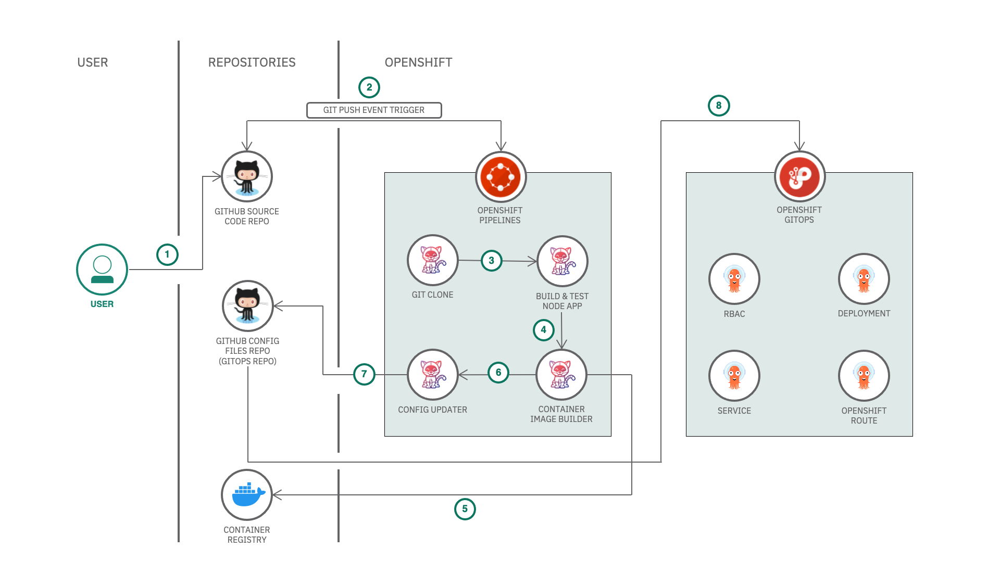

# Automate OpenShift Deployments using Tekton CI and ArgoCD

In this code pattern, we will [create something] using [technologies] and [components]. [Explain briefly how things work]. [Give acknowledgements to others if necessary]

When you have completed this code pattern, you will understand how to:

* [goal 1]
* [goal 2]
* [goal 3]
* [goal 4]

<!--add an image in this path-->

<!--Optionally, add flow steps based on the architecture diagram-->
## Flow

1. User checks in the code to the source control repository
2. GitHub webhook triggers an OpenShift Pipeline on the push event
3. First Tekton CI task runs to clone the code from the GitHub repository
4. Second Tekton CI task runs to build the container image from the source code. The image is then pushed to the container registry
5. Third Tekton CI task runs to update the deployment configuration with the new image and store the configuration files in the GitOps repository
6. The OpenShift GitOps picks up the configuration files from the GitOps repository and deploys to the OpenShift cluster

# Watch the Video

Coming Soon!
<!--  -->

# Steps

1. [Setup Repositories](#1-setup-repositories)
    * 1.1. [Setup source code repository](#1-1-setup-source-code-repository)
    * 1.2. [Setup GitOps repository](#1-2-setup-gitops-repository)
    * 1.3. [Setup container registry](#1-3-setup-container-registry)
2. [Setup OpenShift Pipeline Operator](#2-setup-open-shift-pipeline-operator)
    * 2.1. [Deploy OpenShift Pipeline on the cluster](#2-1-deploy-open-shift-pipeline-on-the-cluster)
    * 2.2. [Create Tekton Tasks, Pipeline and Secrets](#2-2-create-tekton-tasks-pipeline-and-secrets)
    * 2.3. [Run the Tekton Pipeline](#2-3-run-the-tekton-pipeline)
3. [Setup OpenShift GitOps Operator](#3-setup-open-shift-gitops-operator)
    * 3.1. [Deploy OpenShift GitOps on the cluster](#3-1-deploy-open-shift-gitops-on-the-cluster)
    * 3.2. [Create ArgoCD Application](#3-2-create-argo-cd-application)
    * 3.3. [Run the ArgoCD Application](#3-3-run-the-argo-cd-application)
4. [Setup Trigger and Event Listener](#4-setup-trigger-and-event-listeners)
    * 4.1. [Create a Tekton Trigger for the Tekton Pipeline](#4-1-create-a-tekton-trigger-for-the-tekton-pipeline)
    * 4.2. [Add webhook to the source code repository](#4-2-add-webhook-to-the-source-code-repository)
5. [Automated deployment of the application in action](#5-automated-deployment-of-the-application-in-action)

## 1. Setup Repositories

### 1.1. Setup source code repository

We have created a Template Repository with a sample application. You can use the sample application to complete this code pattern.

* Create a repository with [this template on GitHub](https://github.com/IBM/sample-temperature-converter-app/generate). It can be a public or private Repository.
* Once the repository is created, create a [Personal Access Token](https://github.com/settings/tokens/new) with scope=`public_repo` if its a public repository or scope=`repo` if its a private repository.

    >Note: Make sure to copy your personal access token when its generated. You won’t be able to see it later!

#### About the application

The app that you see in the repository is a simple temperature converter application built with NodeJS and Express framework.

**Note:** Copy the GitHub source code repository url as it will be used in the subsequent steps.

**Note:** Copy the GitHub Personal Access Token as it will be used in the subsequent steps.

### 1.2. Setup GitOps repository

We have created a Template Repository with Helm chart for the sample application. You can use the Helm chart for the sample application to complete this code pattern.

* Create a GitOps repository with [this template on GitHub](https://github.com/IBM/sample-temperature-converter-gitops/generate). It can be a public or private Repository.
    > Note: The same personal access token that you created above will be used to access the GitOps repository.

**Note:** Copy the GitHub GitOps repository url as it will be used in the subsequent steps.

### 1.3. Setup container registry

You will need a container registry to store the container images generated by the tekton pipeline. You can use any container registry of your choice. In this code pattern, we'll show you how to create a DockerHub container registry.

* Create a [Docker ID](https://hub.docker.com/) or Login with your existing Docker ID on [Docker Hub](https://hub.docker.com/).
* Goto the [Account Settings > Security](https://hub.docker.com/settings/security) section in your Docker Hub.
* Click on **New Access Token**.
  * Enter **Access Token Description** as `tekton-pipeline`
  * Select **Access permissions** as `Read, Write, Delete`
  * Click on **Generate**.
* Copy the Access Token.
    > Note: This access token will only be displayed once. It will not be stored and cannot be retrieved. Please be sure to save it now.

**Note:** Copy the Docker Personal Access Token as it will be used in the subsequent steps.

## 2. Setup OpenShift Pipeline Operator

### 2.1. Deploy OpenShift Pipeline on the cluster

Open your OpenShift web console. Follow the instructions to deploy the OpenShift Pipeline Operator on your OpenShift cluster.

* Goto **Operators > OperatorHub** and search for **OpenShift Pipeline**. Select the **Red Hat OpenShift Pipelines** operator.
    
* Click on **Install** in the panel.
    
* Select the following options:
  * Update channel: **stable**
  * Installation modes: **All namespace on the cluster (default)**
  * Installed Namespace: **openshift-operators**
  * Update approval: **Automatic**

  
  * Click on **Install**.
  * Wait for the installation to complete. Once complete you will see the following message.

  

At this point you have successfully deployed OpenShift Pipelines on your OpenShift cluster. A new **Pipelines** tab will appear on the left panel of the OpenShift web console under **Administrator** view as shown.

>{: width=40%}

### 2.2. Create Tekton Tasks, Pipeline and Secrets

### 2.3. Run the Tekton Pipeline

## 3. Setup OpenShift GitOps Operator

### 3.1. Deploy OpenShift GitOps on the cluster

Open your OpenShift web console. Follow the instructions to deploy the OpenShift GitOps Operator on your OpenShift cluster.

* Goto **Operators > OperatorHub** and search for **OpenShift GitOps**. Select the **Red Hat OpenShift GitOps** operator.
    
* Click on **Install** in the panel.
    
* Select the following options:
  * Update channel: **stable**
  * Installation modes: **All namespace on the cluster (default)**
  * Installed Namespace: **openshift-operators**
  * Update approval: **Automatic**

  
  * Click on **Install**.
  * Wait for the installation to complete. Once complete you will see the following message.

  

At this point you have successfully deployed OpenShift GitOps on your OpenShift cluster. **Cluster Argo CD** will appear on top **menu** as shown.

>

### 3.2. Create ArgoCD Application

### 3.3. Run the ArgoCD Application

## License

This code pattern is licensed under the Apache License, Version 2. Separate third-party code objects invoked within this code pattern are licensed by their respective providers pursuant to their own separate licenses. Contributions are subject to the [Developer Certificate of Origin, Version 1.1](https://developercertificate.org/) and the [Apache License, Version 2](https://www.apache.org/licenses/LICENSE-2.0.txt).

[Apache License FAQ](https://www.apache.org/foundation/license-faq.html#WhatDoesItMEAN)
